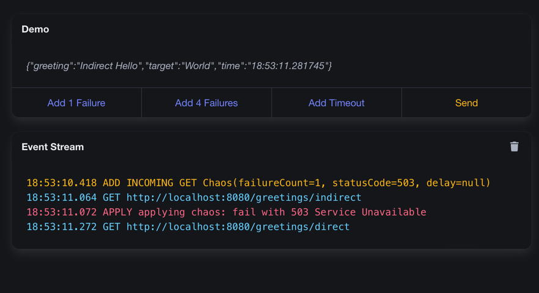

= Chaos Monkey for Jakarta EE

This is currently only a proof of concept to show how a Chaos Monkey could be implemented for Jakarta EE applications. It currently only supports JAX-RS.

See https://github.com/codecentric/chaos-monkey-spring-boot[Chaos Monkey for Spring Boot] for a more mature implementation.

To give it a try, you can run:

[source,bash]
----
./mvnw clean install
./mvnw -pl demo clean wildfly:dev
----

Note that you need to `install` the project first, so `wildfly:dev` can resolve the dependencies. (Note: the dev-mode doesn't work properly here, but I currently don't understand why.)

This will download and start a WildFly server with the demo application deployed that includes the Chaos Monkey as well as a Demo UI. You can then navigate to http://localhost:8080/chaos-ui.

The top part allows you to run the demo application: use the `Send` button (or simply press `Enter`) to send a request to the demo application. The response will be displayed in the field directly above. The other buttons allow you to configure some chaos.

The lower part shows the events happening. In the picture shown here, the `Add 1 Failure` has been pressed before sending the request. There was a single `503 Service Unavailable` response, which is shown in the events, but the request was still successful, as the demo application automatically does a retry. Try the other buttons to see what happens.
